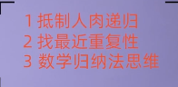

# Data Structure
* 数据结构与算法
    * [常见排序的时间复杂度](#常见排序的时间复杂度)
    * [数组和链表](#数组和链表)
    * [递归](#递归)
    * [刷题](#刷题)
    * [参考文章](#参考文章)
## 常见排序的时间复杂度

1. 快排空间复杂度 O(logn) 
    排序时需要选择断点，最坏情况下为 `O(N) `;大样本下期望为`O(logn)`;

## 数组和链表

1. 在内存中如何存储？
2. 什么场景下适合用数组？
如果给一串同样的数字，用数组和链表存储，问挨个遍历数组和链表，哪个效率高？为什么高？

    1）寻址操作次数链表要多一些。数组只需对 [基地址+元素大小*k] 就能找到第k个元素的地址，对其取地址就能获得该元素。链表要获得第k个元素，首先要在其第k-1个元素寻找到其next指针偏移，再将next指针作为地址获得值，这样就要从第一个元素找起，多了多步寻址操作，当数据量大且其它操作较少时，这就有差距了。

    2）CPU缓存会把一片连续的内存空间读入，因为数组结构是连续的内存地址，所以数组全部或者部分元素被连续存在CPU缓存里面，平均读取每个元素的时间只要3个CPU时钟周期。   而链表的节点是分散在堆空间里面的，这时候CPU缓存帮不上忙，只能是去读取内存，平均读取时间需要100个CPU时钟周期。这样算下来，数组访问的速度比链表快33倍！ （这里只是介绍概念，具体的数字因CPU而异）。

## 递归
[深刻理解递归-CSDN](https://blog.csdn.net/ZT7524/article/details/102761502)
- Python代码模板

- 主要思想

## 刷题
先刷`剑指offer`，再刷`LeetCode`。剑指offer 熟练到随便拎出来一道题有很大的把我能够手写出来就行，`LeetCode`可以按分类刷，一般200到左右就行。
以下是我刷题的过程中做的一些整理，其中掺杂了个人的理解。仅供参考。
- [剑指offer](https://github.com/tzhou2018/swordToOffer)
    题目顺序基本上与牛客保持一致，在`/other`目录下增加了牛客上缺少的题目。

- [LeetCode](https://github.com/tzhou2018/LeetCode)
    Leetcode上一千多道题目，参考前辈们整理的文档，精选了大概200左右的题目， 同时按类别进行了整理。

## 参考文章
[堆，栈说明](https://www.cnblogs.com/kevinGaoblog/archive/2012/03/23/2413102.html)
[数组为什么比链表快？](https://blog.csdn.net/islandww/article/details/72511737)