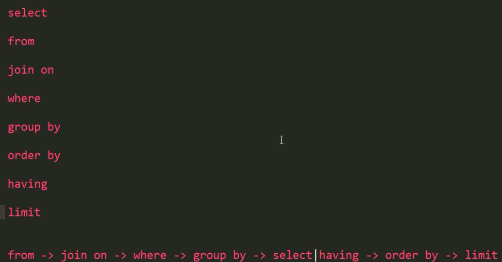
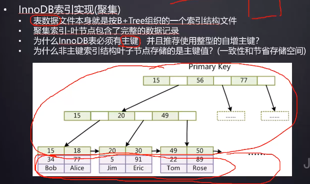
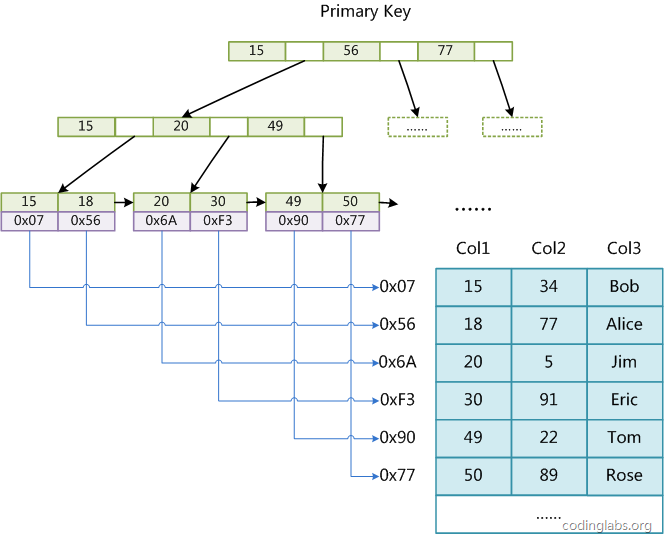
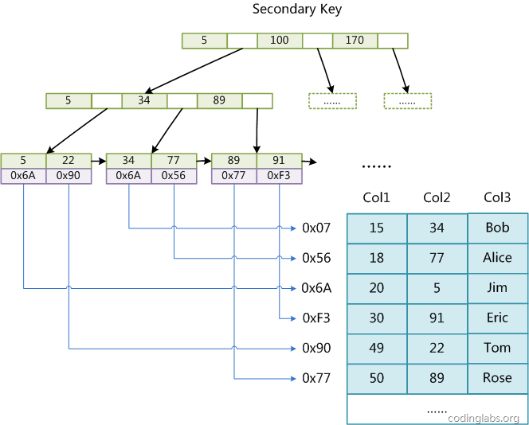
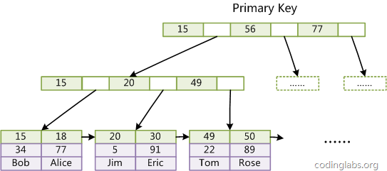

# Database
* 数据库
    * [笔试题](*笔试题)
    * [Mysql数据库引擎](*Mysql数据库引擎)
    * [并发控制机制](*并发控制机制)
    * [事务(ACID)](*事务(ACID))
    * [隔离级别](*隔离级别)
    * [常见的封锁类型？](*常见的封锁类型？)
    * [数据库优化](*数据库优化)
    * [三大范式](*三大范式)
    * [索引](*索引)
    * [视图和表](*视图和表)
    * [参考文章](*参考文章)

## 笔试题
[SQL面试题案例数据创建以及答案](https://zhuanlan.zhihu.com/p/50109656)
[行转列-列转行操作](https://www.cnblogs.com/xiaoxi/p/7151433.html)

一条SQL了解执行顺序

## Mysql数据库引擎
- InnoDB 和 MyISAM，
1. InnoDB 支持事务，MyISAM 不支持事务。这是 MySQL 将默认存储引擎从 MyISAM 变成 InnoDB 的重要原因之一；
2. InnoDB 支持外键，而 MyISAM 不支持。对一个包含外键的 InnoDB 表转为 MYISAM 会失败；  
3. InnoDB 是聚集索引，MyISAM 是非聚集索引。

## 并发控制机制
### 乐观锁 悲观锁
乐观锁和悲观锁其实都是并发控制的机制，同时它们在原理上就有着本质的差别；

- 乐观锁是一种思想，它其实并不是一种真正的『锁』，它会先尝试对资源进行修改，在写回时判断资源是否被其他事务进行了改变，如果没有发生改变就会写回，否则就会进行重试，在整个的执行过程中其实都没有对数据库进行加锁；
- 悲观锁就是一种真正的锁了，它会在获取资源前对资源进行加锁，确保同一时刻只有有限的线程能够访问该资源，其他想要尝试获取资源的操作都会进入等待状态，直到该线程完成了对资源的操作并且释放了锁后，其他线程才能重新操作资源；

虽然乐观锁和悲观锁在本质上并不是同一种东西，一个是一种思想，另一个是一种真正的锁，但是它们都是一种并发控制机制。

乐观锁不会存在死锁的问题，但是由于更新后验证，所以当**冲突频率和重试成本较高**时更推荐使用悲观锁，而需要非常高的**响应速度并且并发量**非常大的时候使用乐观锁就能较好的解决问题，在这时使用悲观锁就可能出现严重的性能问题；在选择并发控制机制时，需要综合考虑上面的四个方面（冲突频率、重试成本、响应速度和并发量）进行选择。

- 悲观锁
正如其名，它指的是对数据被外界（包括本系统当前的其他事务，以及来自外部系统的事务处理）修改持保守态度，因此，在整个数据处理过程中，将数据处于锁定状态。悲观锁的实现，往往依靠数据库提供的锁机制（也只有数据库层提供的锁机制才能真正保证数据访问的排他性，否则，即使在本系统中实现了加锁机制，也无法保证外部系统不会修改数据）。

在悲观锁的情况下，为了保证事务的隔离性，就需要一致性锁定读。读取数据时给加锁，其它事务无法修改这些数据。修改删除数据时也要加锁，其它事务无法读取这些数据。

- 乐观锁
相对悲观锁而言，乐观锁机制采取了更加宽松的加锁机制。悲观锁大多数情况下依靠数据库的锁机制实现，以保证操作最大程度的独占性。但随之而来的就是数据库性能的大量开销，特别是对长事务而言，这样的开销往往无法承受。

而乐观锁机制在一定程度上解决了这个问题。乐观锁，大多是基于数据版本（ Version ）记录机制实现。何谓数据版本？即为数据增加一个版本标识，在基于数据库表的版本解决方案中，一般是通过为数据库表增加一个 “version” 字段来实现。读取出数据时，将此版本号一同读出，之后更新时，对此版本号加一。此时，将提交数据的版本数据与数据库表对应记录的当前版本信息进行比对，如果提交的数据版本号大于数据库表当前版本号，则予以更新，否则认为是过期数据。

要说明的是，MVCC的实现没有固定的规范，每个数据库都会有不同的实现方式，这里讨论的是InnoDB的MVCC。
## 事务(ACID)
数据库事务是数据库管理系统执行过程中的一个逻辑单位，由一个有限的数据库操作序列构成。MySQL 事务主要用于处理操作量大，复杂度高的数据。比如说，在人员管理系统中，你删除一个人员，你既需要删除人员的基本资料，也要删除和该人员相关的信息，如信箱，文章等等，这样，这些数据库操作语句就构成一个事务！在数据提交工作时，要么保证所有的修改都能够提交，要么就所有的修改全部回滚。

1. 原子性（Atomicity）
事务被视为不可分割的最小单元，事务的所有操作要么全部提交成功，要么全部失败回滚。

回滚可以用回滚日志（Undo Log）来实现，回滚日志记录着事务所执行的修改操作，在回滚时反向执行这些修改操作即可。

2. 一致性（Consistency）
数据库在事务执行前后都保持一致性状态。在一致性状态下，所有事务对同一个数据的读取结果都是相同的。

3. 隔离性（Isolation）
一个事务所做的修改在最终提交以前，对其它事务是不可见的。

4. 持久性（Durability）
一旦事务提交，则其所做的修改将会永远保存到数据库中。即使系统发生崩溃，事务执行的结果也不能丢失。

系统发生奔溃可以用重做日志（Redo Log）进行恢复，从而实现持久性。与回滚日志记录数据的逻辑修改不同，重做日志记录的是数据页的物理修改。

### 会出现哪些并发一致性问题？
- **丢失修改**：一个事务对数据进行了修改，在事务提交之前，另一个事务对同一个数据进行了修改，覆盖了之前的修改；
- **脏读**（Dirty Read）：一个事务读取了被另一个事务修改、但未提交（进行了回滚）的数据，造成两个事务得到的数据不一致；
- **不可重复读**（Nonrepeatable Read）：在同一个事务中，某查询操作在一个时间读取某一行数据和之后一个时间读取该行数据，发现数据已经发生修改（可能被更新或删除了）；
- **幻读**（Phantom Read）：当同一查询多次执行时，由于其它事务在这个数据范围内执行了**插入操作**，会导致每次返回不同的结果集（和不可重复读的区别：针对的是一个数据整体/范围；并且需要是插入操作）

## 隔离级别

1. 未提交读（READ UNCOMMITTED）
事务中的修改，即使没有提交，对其它事务也是可见的。

2. 提交读（READ COMMITTED）
一个事务只能读取已经提交的事务所做的修改。换句话说，一个事务所做的修改在提交之前对其它事务是不可见的。

3. 可重复读（REPEATABLE READ）
保证在同一个事务中多次读取同一数据的结果是一样的。

4. 可串行化（SERIALIZABLE）
强制事务串行执行，这样多个事务互不干扰，不会出现并发一致性问题。

该隔离级别需要加锁实现，因为要使用加锁机制保证同一时间只有一个事务执行，也就是保证事务串行执行。

## 常见的封锁类型？

- **排它锁**（Exclusive Lock）/ X锁：事务对数据加上X锁时，只允许此事务读取和修改此数据，并且其它事务不能对该数据加任何锁；
- **共享锁**（Shared Lock）/ S锁：加了S锁后，该事务只能对数据进行读取而不能修改，并且其它事务只能加S锁，不能加X锁
- **意向锁**（Intention Locks）：
    - 一个事务在获得某个**数据行**对象的 S 锁之前，必须先获得**整个表**的 IS 锁或更强的锁；
    - 一个事务在获得某个数据行对象的 X 锁之前，必须先获得整个表的 IX 锁；
    - IS/IX 锁之间都是兼容的；
    - 好处：如果一个事务想要对整个表加X锁，就需要先检测是否有其它事务对该表或者该表中的某一行加了锁，这种检测非常耗时。有了意向锁之后，只需要检测整个表是否存在IX/IS/X/S锁就行了

意向锁之间的互斥图关系表：

- 总结
1. `InnoDB` 支持多粒度锁，特定场景下，**行级锁可以与表级锁共存**。
2. 意向锁之间互不排斥，但除了 `IS` 与 `S` 兼容外，意向锁会与 共享锁 / 排他锁 互斥。
3. `IX`，`IS`是表级锁，不会和行级的`X`，`S`锁发生冲突。只会和表级的`X`，`S`发生冲突。
4. 意向锁在保证并发性的前提下，实现了行锁和表锁共存且满足事务隔离性的要求。

## 数据库优化
1. 语句优化
    应尽量避免在 where 子句中使用!=、<、>操作符或对字段进行null值判断，否则将引擎放弃使用索引而进行全表扫描；
    只返回必要的列：最好不要使用 SELECT * 语句；
    只返回必要的行：使用 LIMIT 语句来限制返回的数据；
    将一个大连接查询分解成对每一个表进行一次单表查询，然后在应用程序中进行关联，这样做的好处有：
    - 让缓存更高效。对于连接查询，如果其中一个表发生变化，那么整个查询缓存就无法使用。而分解后的多个查询，即使其中一个表发生变化，对其它表的查询缓存依然可以使用；
    - 分解成多个单表查询，这些单表查询的缓存结果更可能被其它查询使用到，从而减少冗余的查询；
    - 减少锁竞争
2. 索引的优化
    注意会引起索引失效的情况，以及在适合的地方建立索引
3. 数据库表结构的优化
    - 设计表时遵循三大范式（属性不可分割，非主属性完全依赖于主属性，非主属性不传递依赖与主属性）；
    - 选择合适的数据类型：尽可能不要存储NULL字段；使用简单的数据类型（int, varchar/ text）；
    - 表的水平切分（Sharding）：将同一个表中的记录拆分到多个结构相同的表中（策略：哈希取模；根据ID范围来分）。当一个表的数据不断增多时，Sharding 是必然的选择，它可以将数据分布到集群的不同节点上，从而缓解单个数据库的压力；
    - 表的垂直切分：将一张表按列切分成多个表。可以将不常用的字段单独放在同一个表中；把大字段独立放入一个表中；或者把经常使用的字段（关系密切的）放在一张表中。垂直切分之后业务更加清晰，系统之间整合或扩展容易，数据维护简单
4. 硬件优化

## 三大范式
- **第一范式**（1NF，Normal Form）：**属性不应该是可分的**。举例：如果将“电话”作为一个属性（一列），是不符合1NF的，因为电话这个属性可以分解为家庭电话和移动电话...如果将“移动电话”作为一个属性，就符合1NF；
- **第二范式** 2NF：每个非主属性**完全依赖**于主属性集（候选键集）；
    - B完全依赖于A，就是说A中的所有属性唯一决定B，属性少了就不能唯一决定，属性多了则有冗余（叫依赖不叫完全依赖）。举例：（学号，课程名）这个主属性集可以唯一决定成绩，但是对于学生姓名这个属性，（学号，课程名）这个属性集就是冗余的，所以学生姓名不完全依赖于（学号，课程名）这一属性集；
    - 主属性集/候选码集：某一组属性能够唯一确定其它的属性（主键就是从候选键集中选的一个键），而其子集不能，这样的属性组中的属性就是主属性；不在候选码集中的属性成为非主属性；
    - 可以通过分解来满足 2NF：将（学号，课程名，成绩）做成一张表；（学号，学生姓名）做成另一张表，避免大量的数据冗余；
    满足1NF后，要求表中的所有列，都必须依赖于主键，而不能有任何一列与主键没有关系，也就是说一个表只描述一件事情；
- **第三范式** 3NF：在 2NF 的基础上，非主属性**不传递依赖**于主属性
    - 传递依赖：如果C依赖于B，B依赖于A，那么C传递依赖于A；
    - 3NF在2NF的基础上，消除了非主属性之间的依赖；比如一个表中，主属性有（学号），非主属性有（姓名，院系，院长名），可以看到院长名这个非主属性依赖于院系，传递依赖于学号。消除的办法是分解。
必须先满足第二范式（2NF），要求：表中的每一列只与主键直接相关而不是间接相关，（表中的每一列只能依赖于主键）；

不符合范式会出现哪些异常？

- 冗余数据：某些同样的数据多次出现（如学生姓名）；
- 修改异常：修改了一个记录中的信息，另一个记录中相同的信息却没有修改；
- 删除异常：删除一个信息，那么也会丢失其它信息（删除一个课程，丢失了一个学生的信息）；
- 插入异常：无法插入（插入一个还没有课程信息的学生）

## 索引
索引是帮助Mysql数据库高效的获取**排好序**的**数据结构**。

###  为什么使用索引？
提高效率，若不使用索引，表中的数据将按顺序查询，效率低下。

### 索引数据结构
- 二叉树
若是存储一串有序序列，那么会导致二叉树倾斜（深度增大，类似于链表），查找效率低下。

- 红黑树
渐进复杂度为`O(h)=O(logdN)`，可以看出红黑树`h`高，度数`d`小，导致查找的时间长。因此不适合大数据量。

- `Hash`表
适合精确查找，不适合按范围查找。

- `B`树
解决了红黑树问题，但是同样不适用范围查找。

- `B+`树
1. 非叶子节点不存储data, 只存储索引，可以放更多索引
2. 叶子节点不存储指针
3. 顺序访问指针，提高区间访问性能

### 为什么B+树效率高于其他索引

一般来说，索引本身也很大，不可能全部存储在内存中，因此索引往往以索引文件的形式存储的磁盘上。这样的话，索引查找过程中就要产生磁盘I/O消耗，相对于内存存取，I/O存取的消耗要高几个数量级，所以评价一个数据结构作为索引的优劣最重要的指标就是在查找过程中磁盘I/O操作次数的渐进复杂度。换句话说，索引的结构组织要尽量减少查找过程中磁盘I/O的存取次数。

一般使用磁盘I/O次数评价索引结构的优劣。先从B-Tree分析，根据B-Tree的定义，可知检索一次最多需要访问h个节点。数据库系统的设计者巧妙利用了磁盘预读原理，将一个节点的大小设为等于一个页，这样每个节点只需要一次I/O就可以完全载入。为了达到这个目的，在实际实现B-Tree还需要使用如下技巧：

每次新建节点时，直接申请一个页的空间，这样就保证一个节点物理上也存储在一个页里，加之计算机存储分配都是按页对齐的，就实现了一个node只需一次I/O。

B-Tree中一次检索最多需要h-1次I/O（根节点常驻内存），渐进复杂度为O(h)=O(logdN)。一般实际应用中，出度d是非常大的数字，通常超过100，因此h非常小（通常不超过3）。

综上所述，用B-Tree作为索引结构效率是非常高的。
#### B树相对于红黑树的区别
在大规模数据存储的时候，红黑树往往出现由于树的深度过大而造成磁盘IO读写过于频繁，进而导致效率低下的情况。为什么会出现这样的情况，我们知道要获取磁盘上数据，必须先通过磁盘移动臂移动到数据所在的柱面，然后找到指定盘面，接着旋转盘面找到数据所在的磁道，最后对数据进行读写。磁盘IO代价主要花费在查找所需的柱面上，树的深度过大会造成磁盘IO频繁读写。根据磁盘查找存取的次数往往由树的高度所决定，所以，只要我们通过某种较好的树结构，尽量减少树的高度，B树可以有多个子女，从几十到上千，可以降低树的高度。

**而红黑树这种结构，h明显要深的多。由于逻辑上很近的节点（父子）物理上可能很远，无法利用局部性，所以红黑树的I/O渐进复杂度也为O(h)，效率明显比B-Tree差很多。**

B+Tree更适合外存索引，原因和内节点出度d有关。从上面分析可以看到，d越大索引的性能越好，而出度的上限取决于节点内key和data的大小：

dmax=floor(pagesize/(keysize+datasize+pointsize))
floor表示向下取整。由于B+Tree内节点去掉了data域，因此可以拥有更大的出度，拥有更好的性能。

### 红黑树与B+ 树应用场景

2者都是有序数据结构，可用作数据容器。
红黑树多用在内部排序，即全放在内存中的，微软STL的map和set的内部实现就是红黑树。
B树多用在内存里放不下，大部分数据存储在外存上时。因为B树层数少，因此可以确保每次操作，读取磁盘的次数尽可能的少。

在数据较小，可以完全放到内存中时，红黑树的时间复杂度比B树低。
反之，数据量较大，外存中占主要部分时，B树因其读磁盘次数少，而具有更快的速度。

### 为什么说B+比B树更适合实际应用中操作系统的文件索引和数据库索引？
- B+的磁盘读写代价更低

    B+的内部结点并没有指向关键字具体信息的指针。因此其内部结点相对B树更小。如果把所有同一内部结点的关键字存放在同一盘块中，那么盘块所能容纳的关键字数量也越多。一次性读入内存中的需要查找的关键字也就越多。相对来说IO读写次数也就降低了。

- B+-tree的查询效率更加稳定

    由于非终结点并不是最终指向文件内容的结点，而只是叶子结点中关键字的索引。所以任何关键字的查找必须走一条从根结点到叶子结点的路。所有关键字查询的路径长度相同，导致每一个数据的查询效率相当。

    数据库索引采用B+树的主要原因是 B树在提高了磁盘IO性能的同时并没有解决元素遍历的效率低下的问题。正是为了解决这个问题，B+树应运而生。B+树只要遍历叶子节点就可以实现整棵树的遍历。而且在数据库中基于范围的查询是非常频繁的，而B树不支持这样的操作（或者说效率太低）

### MyIsam 实现索引
MyISAM引擎使用B+Tree作为索引结构，叶节点的data域存放的是数据记录的地址。下图是MyISAM索引的原理图：

这里设表一共有三列，假设我们以Col1为主键，则图8是一个MyISAM表的主索引（Primary key）示意。可以看出MyISAM的索引文件仅仅保存数据记录的地址。在MyISAM中，主索引和辅助索引（Secondary key）在结构上没有任何区别，只是主索引要求key是唯一的，而辅助索引的key可以重复。如果我们在Col2上建立一个辅助索引，则此索引的结构如下图所示：

### InnoDB索引实现
InnoDB 存储引擎中使用的就是悲观锁

虽然InnoDB也使用B+Tree作为索引结构，但具体实现方式却与MyISAM截然不同。

**第一个重大区别是InnoDB的数据文件本身就是索引文件**。从上文知道，MyISAM索引文件和数据文件是分离的，索引文件仅保存数据记录的地址。而在InnoDB中，表数据文件本身就是按B+Tree组织的一个索引结构，这棵树的叶节点data域保存了完整的数据记录。这个索引的key是数据表的主键，因此InnoDB表数据文件本身就是主索引。

上图是InnoDB主索引（同时也是数据文件）的示意图，可以看到叶节点包含了完整的数据记录。这种索引叫做聚集索引。因为InnoDB的数据文件本身要按主键聚集，所以InnoDB要求表必须有主键（MyISAM可以没有），如果没有显式指定，则MySQL系统会自动选择一个可以唯一标识数据记录的列作为主键，如果不存在这种列，则MySQL自动为InnoDB表生成一个隐含字段作为主键，这个字段长度为6个字节，类型为长整形。

**第二个与MyISAM索引的不同是InnoDB的辅助索引data域存储相应记录主键的值而不是地址**。换句话说，InnoDB的所有辅助索引都引用主键作为data域。例如，下图为定义在Col3上的一个辅助索引：

这里以英文字符的ASCII码作为比较准则。聚集索引这种实现方式使得按主键的搜索十分高效，但是辅助索引搜索需要检索两遍索引：首先检索辅助索引获得主键，然后用主键到主索引中检索获得记录。

了解不同存储引擎的索引实现方式对于正确使用和优化索引都非常有帮助，例如知道了InnoDB的索引实现后，就很容易明白为什么不建议使用过长的字段作为主键，因为所有辅助索引都引用主索引，过长的主索引会令辅助索引变得过大。再例如，用非单调的字段作为主键在InnoDB中不是个好主意，因为InnoDB数据文件本身是一颗B+Tree，非单调的主键会造成在插入新记录时数据文件为了维持B+Tree的特性而频繁的分裂调整，十分低效，而使用自增字段作为主键则是一个很好的选择。

### 缺点,适合建索引的条件
索引文件本身要消耗存储空间，同时索引会加重插入、删除和修改记录时的负担，另外，MySQL在运行时也要消耗资源维护索引，因此索引并不是越多越好。一般两种情况下不建议建索引。

1. 第一种情况是表记录比较少，例如一两千条甚至只有几百条记录的表，没必要建索引，让查询做全表扫描就好了。至于多少条记录才算多，这个个人有个人的看法，我个人的经验是以2000作为分界线，记录数不超过 2000可以考虑不建索引，超过2000条可以酌情考虑索引。

2. 另一种不建议建索引的情况是索引的选择性较低。所谓索引的选择性（Selectivity），是指不重复的索引值（也叫基数，Cardinality）与表记录数（#T）的比值：
`Index Selectivity = Cardinality / #T`
显然选择性的取值范围为(0, 1]，选择性越高的索引价值越大，这是由B+Tree的性质决定的。

3. 某列经常作为最大最小值；
4. 经常被查询的字段；
5. 经常用作表连接的字段；
6. 经常出现在ORDER BY/GROUP BY/DISDINCT后面的字段

## 视图和表
- 区别：
      1、视图是已经编译好的sql语句。而表不是  
      2、视图没有实际的物理记录。而表有。
      3、表是内容，视图是窗口
      4、表只用物理空间而视图不占用物理空间，视图只是逻辑概念的存在，表可以及时对它进行修改，但视图只能有创建的语句来修改
      5、表是内模式，视图是外模式
      6、视图是查看数据表的一种方法，可以查询数据表中某些字段构成的数据，只是一些SQL语句的集合。从安全的角度说，视图可以不给用户接触数据表，从而不知道表结构。
      7、表属于全局模式中的表，是实表；视图属于局部模式的表，是虚表。 
      8、视图的建立和删除只影响视图本身，不影响对应的基本表。

- 联系：
    视图（view）是在基本表之上建立的表，它的结构（即所定义的列）和内容（即所有数据行）都来自基本表，它依据基本表存在而存在。一个视图可以对应一个基本表，也可以对应多个基本表。视图是基本表的抽象和在逻辑意义上建立的新关系。
    
## 常见问题
### 一条Sql语句为什么执行的很慢？

1、大多数情况下很正常，偶尔很慢，则有如下原因

    (1)、数据库在刷新脏页，例如 redo log 写满了需要同步到磁盘。
    (2)、执行的时候，遇到锁，如表锁、行锁。

2、这条 SQL 语句一直执行的很慢，则有如下原因。

    (1)、没有用上索引：例如该字段没有索引；由于对字段进行运算、函数操作导致无法用索引。
    (2)、数据库选错了索引。

## 参考文章
[数据库](https://snailclimb.gitee.io/javaguide/#/docs/database/MySQL)
[『浅入浅出』MySQL 和 InnoDB](https://draveness.me/mysql-innodb)
[参考文章--美团技术团队](https://tech.meituan.com/2014/08/20/innodb-lock.html)
[意向锁参考--掘金](https://juejin.im/post/5b85124f5188253010326360)
[红黑树应用场景--CSDN](https://blog.csdn.net/benpaobagzb/article/details/50805711)
[MySQL索引背后的数据结构及算法原理](http://blog.codinglabs.org/articles/theory-of-mysql-index.html)
[Mysql--B+树索引---公众号](https://mp.weixin.qq.com/s?__biz=Mzg2NzA4MTkxNQ==&mid=2247487296&idx=1&sn=98f6fd5042117e73e4cfe57741a28372&chksm=ce404494f937cd820e254a7248d8777891c7de35e9472fb4b9f27730523a6bfb5fecd7261b62&scene=126&sessionid=1586671333&key=477a62bdccbfff3361c887655e5ba1884e2cfc07a6d80ef08567345cf9284e1e7035070bc904bd292d1639163c2add7be788d8eaa05ed829f71f3a9ef756e8409b8944a502e66c1b90bfa4afd2d19357&ascene=1&uin=NzY1NTk2OTYy&devicetype=Windows+10&version=62080079&lang=zh_CN&exportkey=AQCbnQKrniaQQHbo600Brmw%3D&pass_ticket=0N7nD63AqWB6KC4njARwsVlWuJ4NRZBuCQAPJ%2B6Utxq1VfsyL6LFXyZyyNm8jIS2)
[视图和表的区别](https://www.cnblogs.com/binyao/p/4899970.html)
[一条Sql语句为什么执行的很慢？](https://mp.weixin.qq.com/s?__biz=Mzg2OTA0Njk0OA==&mid=2247485185&idx=1&sn=66ef08b4ab6af5757792223a83fc0d45&chksm=cea248caf9d5c1dc72ec8a281ec16aa3ec3e8066dbb252e27362438a26c33fbe842b0e0adf47&token=79317275&lang=zh_CN#rd)
[Waking-Up](https://github.com/wolverinn/Waking-Up)
[CS-Notes](https://github.com/tzhou2018/CS-Notes)
