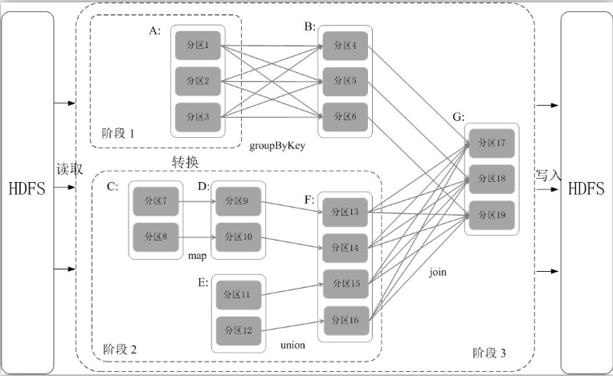
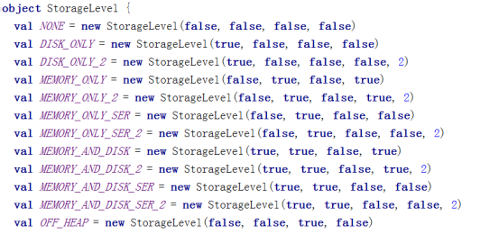
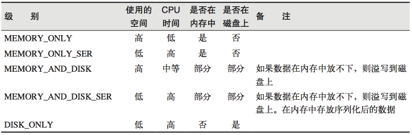
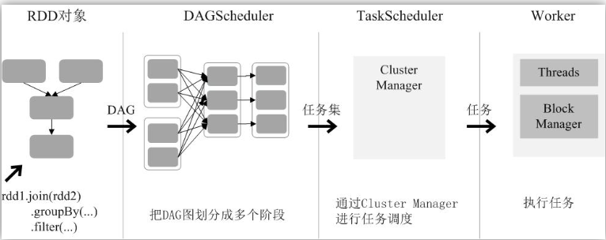
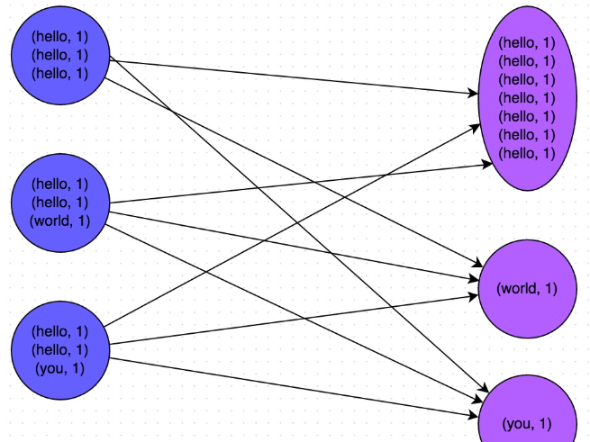
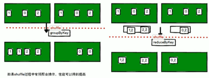

## Spark相关

### 1. 阶段划分

Spark通过分析各个RDD的依赖关系生成了DAG，再通过分析各个RDD中的分区之间的依赖关系来决定如何划分阶段，具体划分方法是：在DAG中进行反向解析，遇到宽依赖就断开，遇到窄依赖就把当前的RDD加入到当前的阶段中；将窄依赖尽量划分在同一个阶段中，可以实现流水线计算（具体的阶段划分算法请参见AMP实验室发表的论文《Resilient Distributed Datasets: A Fault-Tolerant Abstraction for In-Memory Cluster Computing》）。例如，下图所示，假设从HDFS中读入数据生成3个不同的RDD（即A、C和E），通过一系列转换操作后再将计算结果保存回HDFS。对DAG进行解析时，在依赖图中进行反向解析，由于从RDD A到RDD B的转换以及从RDD B和F到RDD G的转换，都属于宽依赖，因此，在宽依赖处断开后可以得到三个阶段，即阶段1、阶段2和阶段3。可以看出，在阶段2中，从map到union都是窄依赖，这两步操作可以形成一个流水线操作，比如，分区7通过map操作生成的分区9，可以不用等待分区8到分区9这个转换操作的计算结束，而是继续进行union操作，转换得到分区13，这样流水线执行大大提高了计算的效率。

对于窄依赖，partition的转换处理在Stage中完成计算。对于宽依赖，由于有Shuffle的存在，只能在parent RDD处理完成后，才能开始接下来的计算，因此宽依赖是划分Stage的依据。

由上述论述可知，把一个DAG图划分成多个“阶段”以后，每个阶段都代表了一组关联的、相互之间没有Shuffle依赖关系的任务组成的任务集合。每个任务集合会被提交给任务调度器（TaskScheduler）进行处理，由任务调度器将任务分发给Executor运行。

[参考文章-厦门大学大数据实验室](http://dblab.xmu.edu.cn/blog/985-2/)

### 2. 缓存
#### cache persist

RDD通过persist方法或cache方法可以将前面的计算结果缓存，默认情况下 persist() 会把数据以序列化的形式缓存在 JVM 的堆空间中。 

但是并不是这两个方法被调用时立即缓存，而是触发后面的action时，该RDD将会被缓存在计算节点的内存中，并供后面重用。

通过查看源码发现cache最终也是调用了persist方法，默认的存储级别都是仅在内存存储一份，Spark的存储级别还有好多种，存储级别在object StorageLevel中定义的。

在存储级别的末尾加上“_2”来把持久化数据存为两份

#### checkPoint
Spark中对于数据的保存除了持久化操作之外，还提供了一种检查点的机制，检查点（本质是通过将RDD写入Disk做检查点）是为了通过lineage做容错的辅助，lineage过长会造成容错成本过高，这样就不如在中间阶段做检查点容错，如果之后有节点出现问题而丢失分区，从做检查点的RDD开始重做Lineage，就会减少开销。检查点通过将数据写入到HDFS文件系统实现了RDD的检查点功能。

为当前RDD设置检查点。该函数将会创建一个二进制的文件，并存储到checkpoint目录中，该目录是用SparkContext.setCheckpointDir()设置的。在checkpoint的过程中，该RDD的所有依赖于父RDD中的信息将全部被移除。对RDD进行checkpoint操作并不会马上被执行，必须执行Action操作才能触发。

### 3. RDD 运行过程

`RDD` 在`Spark`架构中的运行过程：

创建`RDD`对象；
`SparkContext`负责计算`RDD`之间的依赖关系，构建`DAG`;
`DGAScheduler`负责把`DAG`分解成多个阶段，每个阶段中包含了多个任务，每个任务都会被任务调度器分发给各个工作节点（`Worker Node`）上的`Executor`去执行。

### 4. 任务划分

RDD任务切分中间分为：Application、Job、Stage和Task

1）Application：初始化一个SparkContext即生成一个Application
2）Job：一个Action算子就会生成一个Job
3）Stage：根据RDD之间的依赖关系的不同将Job划分成不同的Stage，遇到一个宽依赖则划分一个Stage。
4）Task：Stage是一个TaskSet，将Stage划分的结果发送到不同的Executor执行即为一个Task。
**注意：Application->Job->Stage-> Task每一层都是1对n的关系。**

### 5. 数据倾斜

[解决方案](https://blog.csdn.net/u010039929/article/details/55044407)
[解决方案2-CSDN***](https://blog.csdn.net/weixin_35353187/article/details/84303518?depth_1-utm_source=distribute.pc_relevant.none-task&utm_source=distribute.pc_relevant.none-task)

#### 原理
数据倾斜的原理很简单：在进行shuffle的时候，必须将各个节点上相同的key拉取到某个节点上的一个task来进行处理，比如按照key进行聚合或join等操作。此时如果某个key对应的数据量特别大的话，就会发生数据倾斜。比如大部分key对应10条数据，但是个别key却对应了100万条数据，那么大部分task可能就只会分配到10条数据，然后1秒钟就运行完了；但是个别task可能分配到了100万数据，要运行一两个小时。因此，整个Spark作业的运行进度是由运行时间最长的那个task决定的。

　　因此出现数据倾斜的时候，Spark作业看起来会运行得非常缓慢，甚至可能因为某个task处理的数据量过大导致内存溢出。

　　下图就是一个很清晰的例子：hello这个key，在三个节点上对应了总共7条数据，这些数据都会被拉取到同一个task中进行处理；而world和you这两个key分别才对应1条数据，所以另外两个task只要分别处理1条数据即可。此时第一个task的运行时间可能是另外两个task的7倍，而整个stage的运行速度也由运行最慢的那个task所决定。

#### 预聚合处理
如： `groupByKey`和`reduceByKey`

1. reduceByKey：按照key进行聚合，在shuffle之前有combine（预聚合）操作，返回结果是RDD[k,v].
2. groupByKey：按照key进行分组，直接进行shuffle。
3. 开发指导：reduceByKey比groupByKey，建议使用。但是需要注意是否会影响业务逻辑。

### 6. Spark Pipeline
[Spark Pipeline初探--腾讯云社区](https://cloud.tencent.com/developer/article/1365923)

ML管道提供了一组构建在DataFrames之上的统一的高级api，帮助用户创建和优化实际的机器学习管道。

### 7.  Spark列式存储，Spark中Join连接

   [列式存储-CSDN](https://blog.csdn.net/yu616568/article/details/50993491)
    1)作用：在类型为(K,V)和(K,W)的RDD上调用，返回一个相同key对应的所有元素对在一起的(K,(V,W))的RDD
    2)需求：创建两个pairRDD，并将key相同的数据聚合到一个元组。
 
### 8. 共享变量
- 累加器
- 广播变量
### Spark运行模式（任务执行流程）
见`./大数据学习/Spark编程`

## Hive

HiveSQL底层是怎么实现的？比如两张表Join的时候会有哪些操作？需要shuffle这一步吗？

[hiveSql-Join操作](http://lxw1234.com/archives/2015/06/313.htm)

## HDFS

### hdfs小文件过多会怎么样
[参考文章--CSDN](https://blog.csdn.net/SunnyYoona/article/details/53870077)
[参考文章--腾讯云社区](https://cloud.tencent.com/developer/article/1512285)
因为在hdfs 中，数据的元数据信息是保存在NameNode上的，hdfs本身的作用就是用来存储海量文件的，首先小文件过多的话，会增加NameNode 的压力，，因为NameNode是要接收集群中所有的DataNode的心跳信息，来确定元数据的信息变化的，另外，文件中可使用的block块的个数是有限制的，hadoop用来处理数据的话，小文件的延迟，和数据量虽然很小，但是有些地方和大文件所耗的时间相同，所以最好做优化，避免这种情况的发生。

小文件除了可能会撑爆NameNode。另一个是hive或者spark计算的时候会影响它的速度，因为spark计算时会将数据从硬盘读到内存，零碎的文件将产生较多的寻道过程。
### namenode 损坏，如何恢复
如果运行 namenode服务的机器毁坏，文件系统上所有文件将会丢失，因为不知道如何根据 datanode 的块重建文件。因此，对namenode实现容错很重要，hadoop实现了两种容错机制。
1. 备份那些组成文件系统元数据持久状态的文件；
2. 运行一个辅助的namenode。但它不能被用作namenode。这个辅助 namenode 的重要作用是定期合并编辑日志与命名空间镜像，以防止编辑日志过大

### HDFS上传流程以及操作命令
客户端请求上传，dfs底层与服务端建立通信，服务端（NameNode）创建元数据信息，其中包括文件名，文件路径，数据块；
接着客户端创建一个输出流把文件切块，上传第一个数据块，通过水平复制，达到冗余度的要求，这里会通过循环，直至上传完所有的数据块。

[HDFS上传流程以及操作命令-掘金](https://juejin.im/post/6844903656794357773)
## Yarn
### 调度选项
参考资料：《Hadoop权威指南》P85
1. 先进先出（FIFO)调度器
2. 容量调度器
3. 公平调度器